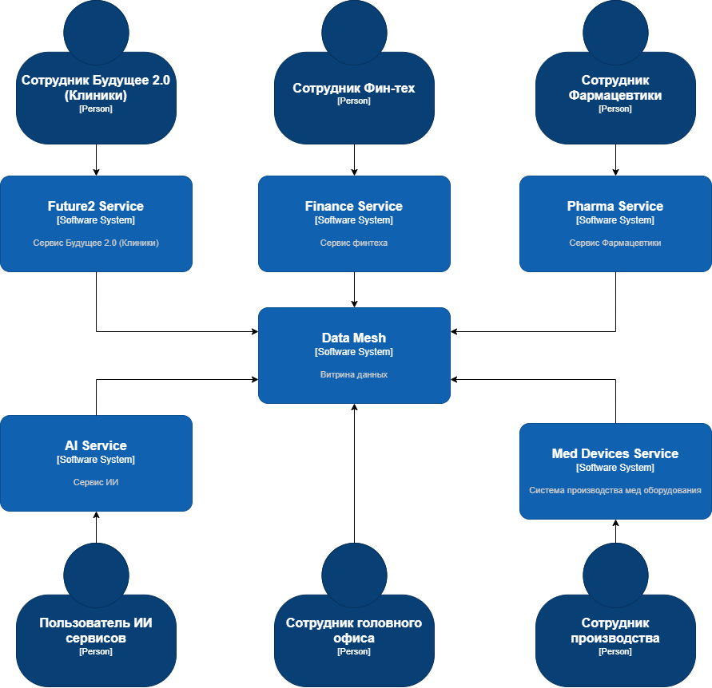

# Задание 1

1. **Спроектируйте архитектуру системы через год.** Составьте диаграмму контейнеров в модели C4.
2. **Опишите проблемные места.** Сделайте это в удобной для вас форме. Например, можете использовать список или таблицу. Постарайтесь формулировать описания так, чтобы они были понятны не только инженерам, но и бизнесу.
3. **Приоритизируйте выявленные проблемы.** Для этого вы можете использовать методы, которые изучили на курсе. Например, MoSCoW или матрицу Эйзенхауэра.

# Решение

## Архитектура системы через год

[Архитектура системы через год](./C4-model-schema.drawio)

## Проблемные места

- **Производительность.** Уже сейчас нужную отчётность сложно построить за разумное время (очень много данных (сотни терабайт) и вариантов их использования.). При подключении новых сервисов, новых организаций, текущая система и БД не сможет справиться с нагрузкой.

- **Устаревшие технологии.** DWH на базе Microsoft SQL-сервера 2008 года, поддержка этой технологии закончилась еще 9 июля 2019 года.

- **Одна БД с большим количеством бизнес-логики.** Даже если регулярно создаются бэкапы исходной БД, необходимо реализовать масштабирование и репликацию БД. Тогда получится решить проблемы с производительностью и доступностью.

- **Плохая документация процессов.** Исходя из начальных данных, нет четкой картины распределения и жизненных циклов данных, что говорит о плохой документации.

- **Отсутствует ролевая модель RBAC**. Нет информации о разных ролях доступа в организациях. При работе с медицинскими данными это критически важно.

## Приоритетные проблемы

Воспользуемся одним из методов приоритизации. MoSCoW (Must have, Should have, Could have, Won’t have).

- **Must have**
    - Реализовать ролевую модель доступа к данным.
    - Провести масштабирование системы БД для улучшении производительности.

- **Should have**
    - Провести инветаризацию всех жизенных циклов данных в компании и обновить документацию по ним.

- **Could have**
    - Обновить стек технологий.
