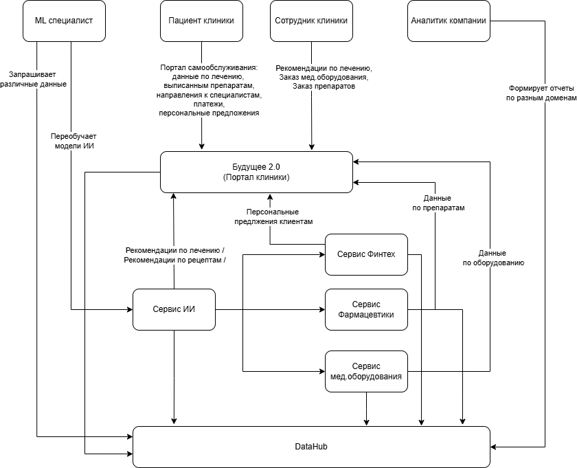

# Задание 2

1. **Разделите систему на домены**, чтобы их можно было независимо развивать без необходимости реализовать новую логику в DWH.
2. **Отразите потоки данных между доменами.** Для этого отрисуйте Data Flow Diagram. Отразите на ней запланированные изменения в архитектуре.
3. **Аргументируйте логику разделения на домены.** Опишите преимущества, которые получит компания, если разделит систему на домены так, как вы предлагаете.

# Решение

## Домены системы

Бизнес хочет развивать все направления независимо, поэтому разделим системы на домены по всем направлениям компании.

- **Будущее 2.0.** Текущая система клиник.
- **Финтех**. Банковский сервис компании.
- **Фармацевтика**. Сеть фармацевтических компаний.
- **Медицинское оборудование**. Электроника для медицинского оборудования.
- **Сервисы ИИ**. Вывели сервисы ИИ в отдельный домен для удобства работы с их данными и аналитикой.
- **Data Warehouse**. Позволит накапливать данные со всех направлений. Но доменные компанды сами должны решать какие данные отправлять в DWH.

## Логика разделения на домены

- Цель бизнеса - разивать все направления компании независимо друг от друга. Поэтому каждое направление это отдельный домен.
- Сервисы ИИ были выведены в отдельный домен, т.к. они будут использоваться во всех других направлениях как отдельный инструмент. Поэтому и развивать их нужно отдельно.

## Потоки данных между доменами

[Потоки данных между доменами](./Data-flow-schema.drawio)

**Пояснение**
- Для упрощения схемы потоков данных, здесь отстуствуют детали реализации интеграций между различными сервисами. Например, нет интеграционной шины данных. Поток данных направлен сразу в каталог данных DataHub.
