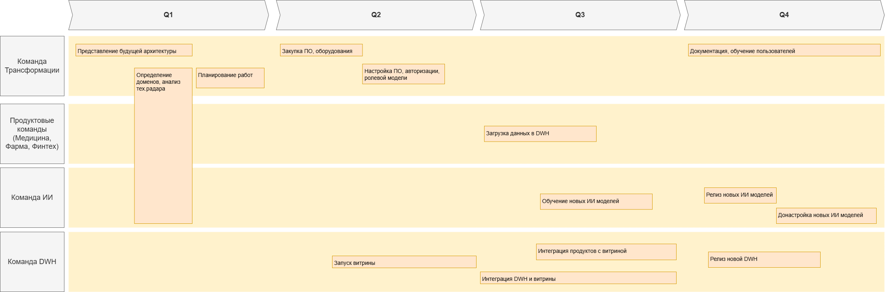

# Задание 3

1. **Сформируйте технический радар.** Отразите на нём текущие технологии и методологии, а также предлагаемые изменения и технологии, которые сопутствуют основному стеку. Оформите радар в виде таблицы или круговой диаграммы.
2. **Составьте роадмап.** Отразите здесь изменения в технологическом ландшафте компании. Радар должен содержать этапы, их результаты, ответственные команды и ресурсы, которые потребуются. Оформите роадмап в draw.io или в другом инструменте на свой выбор.
3. **Обоснуйте изменения.** Опишите, зачем нужен каждый из этапов, которые вы включили в роадмап. Можете сделать это в том же файле, что и сам артефакт.

# Решение

## Технический радар

- **Adopt** — устоявшиеся технологии. Они используются в проде, имеют низкий уровень риска и рекомендуются к широкому применению.

- **Trial** — «пробные» технологии или «технологии на подъёме», которые успешно работают и проверены на реальной проблеме, но у которых, возможно, выявлены ещё не все ограничения. У таких технологий степень риска пока выше в силу небольшого применения.

- **Asset** — «оценочные» технологии, которые являются многообещающими и имеют явную потенциальную ценность для организации — те самые инвестиции. Они подходят для создания прототипов в целях выявления ограничений и возможностей.

- **Hold** — по факту технологии, которые больше нежелательны для применения в новых проектах. Они с большой вероятностью будут постепенно выводиться из ландшафта.

| Adopt         | Trial       |  Asset      | Hold          |
| --------      | -------     | --------    | -------       |
| Python        | PostgreSQL  | MSSQL 2022  | MSSQL 2008    |
| Golang        | BigId       | Apache Kafka| Power Builder |
| Java          | Yandex S3   |             | Apache Camel  |
| ReactJS       | Data Mesh   |             | Power BI      |

- Обновление технологий необходимо для быстрой интеграции новых доменов и решение проблем с производительностью. 
- Некоторые инструменты перестали поддерживаться производителем.  Например, MSSQL 2008 или Apache Camel. Поэтому лучше перейти на новые версии или аналоги.

## Этапы и результаты

[Дорожная карта этапов работ](./Roadmap.drawio)

- Q1
    - Представлена архитектура по трансформации.
    - Определены границы доменов и связи между ними.
    - Запланированы работы в каждом из доменов по переходу.
- Q2:
    - Закуплено и установлено новое ПО и оборудование.
    - Реализована ролевая модель доступа к доменам и данным.
- Q3:
    - Доменые команды уже загрузили свои первые данные в DWH.
    - Команда ИИ сервисов начала обучать новые сервисы.
    - Реализована интеграция DWH и витрины данных.
- Q4:
    - Портал самообслуживания функционирует.
    - Выпущены новые ИИ сервисы.
    - Аналитик могут формировать новые отчеты за разумное время.
